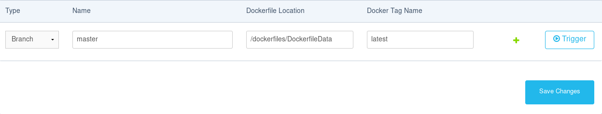

En nuestra arquitectura teníamos tres máquinas, cada una de las cuales cumplía una función. Así Local era la máquina en al que almacenábamos la base de datos, Ppal la máquina central de la arquitectura que actúa como nexo de unión entre los distintos componentes de la misma y Data donde se realizaban cuestiones de datamining sobre los datos obtenidos por nuetra aplicación. Lo que hemos hecho es crear 3 dockerfiles muy sencillos que nos sirven para definir y provisionar imágenes que dan lugar a tres tipos de contenedores que cumplen las funciones que acabamos de enumerar.

En estos dockerfiles provisionamos las máquinas con los mismo módulos que lo hicimos en el hito sobre orquestación, asi tenemos los siguientes archivos:

```yml
FROM ubuntu:trusty
MAINTAINER Gustavo Rivas Gervilla <gustavo.rg92@gmail.com>

RUN apt-get -y update
RUN apt-get install -y mongodb python-flask python-pymongo
```

```yml
FROM ubuntu:trusty
MAINTAINER Gustavo Rivas Gervilla <gustavo.rg92@gmail.com>

RUN apt-get -y update
RUN apt-get install -y python-flask python-pymongo
```

```yml
FROM ubuntu:trusty
MAINTAINER Gustavo Rivas Gervilla <gustavo.rg92@gmail.com>

RUN apt-get -y update
RUN apt-get install -y python-flask python-pandas
```

Para añadir estas imágenes a Docker Hub a partir del mismo repositorio de GitHub hemos seguido un tutorial y lo que hemos hecho es cambiar la instrucción de construcción que viene por defecto especificándole la localización del dockerfile que tendría que usar en cada una de las tres imágenes según se muestra en la siguiente captura:



Además se ha proporcionado en el repositorio un script que se encarga de descargar estras 3 imágenes y crear un contenedor a partir de cada una de ellas, de modo que el proceso sea automático:

```bash
#!/bin/bash

sudo docker pull griger/maquinalocal
sudo docker pull griger/maquinappal
sudo docker pull griger/maquinadata

sudo docker run -itd --name contenedorLocal griger/maquinalocal
sudo docker run -itd --name contenedorPpal griger/maquinappal
sudo docker run -itd --name contenedorData griger/maquinadata
```

