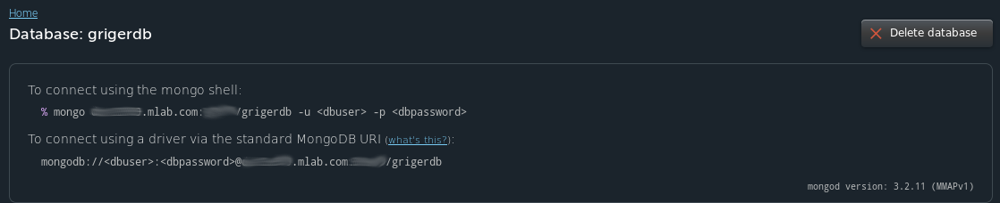
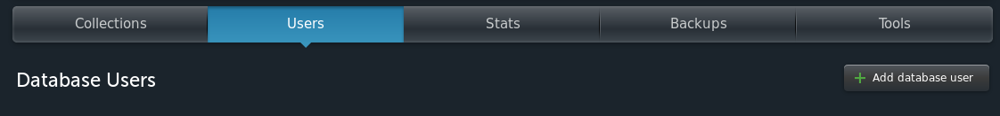

En las prácticas hemos empleado en esencia dos tecnologías distintas, las máquinas virtuales y los contenedores (en nuestro caso con Docker). Los contenedores parecen una solución mucho más robusta que una máquina virtual, como pueden ser las instancias de AWS, ya que aunque empleemos un provisionador como Ansible, haciendo que el *playbook* sea lo más independiente del sistema posible, no podemos asegurar de que éste funcione correctamente para cualquier sistema con el que configuremos la máquina virtual a emplear (p.e. puede que haya ciertos paquetes que no estén disponibles para un S.O. concretos).

En cambio optar por el uso de contenedores Docker nos permite empaquetar todo lo necesario para nuestro aplicación en una solución multiplataforma, por lo tanto elegimos emplear una imagen Docker como el eje central de nuestra configuración final. Ahora bien, todo contenedor Docker necesita de una máquina en la cual desplegarlo, en lugar de optar por desplegar simplemente este contenedor en nuestra máquina local vamos a desplegar el contenedor en una instancia AWS, esta opción siempre será más versatil que trabajar en una máquina local.

Al inicio del proyecto de esta asignatura se describieron dos servicios que pensamos que tenía que tener nuestra arquitectura: una base de datos MongoDB y un sistema de log (también hablamos de una BD basada en grafos para almacenar los datos referentes a la red social de nuestra aplicación, sin embargo para estas prácticas nos centramos sólo en los otros dos servicios).

Podríamos hacer uso por ejemplo del servicio [MongoDB Atlas](https://www.mongodb.com/cloud/atlas/lp/aws-users?jmp=search&utm_source=google&utm_campaign=EMEA-Spain-Atlas-Brand-Alpha&utm_keyword=mongodb%20aws&utm_device=c&utm_network=g&utm_medium=cpc&utm_creative=174534503194&utm_matchtype=e&_bt=174534503194&_bk=mongodb%20aws&_bm=e&_bn=g&gclid=CjwKEAiAq8bEBRDuuOuyspf5oyMSJAAcsEyWAMPlCQ3riI0Ksc8sZWexSPvpdNRNL-ODENUK2vYgsRoCmIfw_wcB) que proporciona instancias para AWS para almacenar bases de datos de Mongo, no obstante no parece que haya una [opción](https://www.mongodb.com/cloud/atlas/pricing) que nos permita emplear este servicio de un modo gratuito. Por otro lado tenemos la opción de la que más hemos hablado en clase y que sí que nos da una opción, aunque limitada, para usar este servicio online [mlab](https://mlab.com/).

En la [documentación de mlab](http://docs.mlab.com/) tenemos los primeros pasos que debemos dar para crear nuestra primera base de datos y conectarla con alguna instancia, en nuestro caso con **AWS** que es lo que nos interesa.

La restricción que puede tener esta *sandbox* (que es la opción gratuita de por vida que nos da mlab) además de que se almacena en un servidor compartido y se ejecuta en una máquina virtual compartida (la memoria RAM que tenemos es variable) y su almacenamiento es de 0.5 GB, es que sólo puede ser creada en ciertas regiones de AWS, por ejemplo en Oregon que es donde hemos venido creando nuestras instancias AWS no podemos crear esta instancia de mlabs; esto no es importante ya que desde cualquier instancia de AWS u otra máquina podremos contectar a la instancia de mlab con nuestra BD.

Una vez hemos creado esta base de datos se nos facilitan las instrucciones para poder conectar a ella desde, por ejemplo, una consola mongo:



Además cuando visitamos la página de esta base de datos se nos informa de dos cosas: la primera es que esta *sandbox* no tiene soporte para replicación con lo que no la recomiendan para un entorno de producción, y la segunda es que añadamos un usuario para conectarnos a la base de datos, que será el que proporcionemos en la instrucción que hemos visto en la captura anterior.



Una vez hemos decidido qué servicio emplearemos para almacenar nuestra base de datos veamos qué servicio de log vamos a emplear en nuestra arquitectura. Por ejemplo tenemos [Graylog](https://www.graylog.org/) que parece ser un servicio de log gratuito y de código abierto, el código lo podemos ver en [GitHub](https://github.com/Graylog2/graylog2-server). Podemos ver cómo instalarlo en AWS [aquí](http://docs.graylog.org/en/2.1/pages/installation/aws.html). Otra opción que tenemos es emplear la solución de la que se ha hablado en clase, [loggly](https://www.loggly.com/plans-and-pricing/) que también nos ofrece una opción gratuita.

Por otro lado y dado que vamos a desplegar nuestra máquina virtual en AWS, podemos usar el propio servicio de log que proporciona esta plataforma, [CloudWatch](https://aws.amazon.com/es/cloudwatch/pricing/) el cuál también proporciona algunos recursos gratuitos como podemos ver en el enlace.

No obstante ya hemos dicho que pretendemos hacer uso de los contenedores Docker como eje central de nuestra arquitectura, por lo tanto encontrar una solución que estuviese diseñada especialmente para este tipo de recursos sería interesante. Tenemos por ejemplo [sematext](https://sematext.com/docker/?t=c:307458666,g:19611938346,l:9047061,m:b,n:g,d:c,dm:,cr:161837115991,k:%2Bdocker%20%2Blog&gclid=CjwKEAiAq8bEBRDuuOuyspf5oyMSJAAcsEyWez5joZfBpdOk6Thw6zs3MzSeH5wy5TU_yXmHZT4bYBoC_pvw_wcB). Esta solución se basa en un agente en forma de contenedor Docker que recopila información de cada uno de los contenedores activos que tengamos en nuestra máquina y de la propia máquina, además este agente es capaz de detectar nuevos contenedor cuando se crean y activan en la máquina lo que lo hace muy potente.

Para obtener datos hemos configurado una aplicación SPM (indicando que es de tipo Docker) y un logsene, según leemos en la documentación estos dos elementos parecen ser distintos y aportar distinta información, de hecho podemos confirmar esto si vemos las tablas de datos que ofrecen cada uno de ellos. En ambos casos hemos cambiado al plan FREE que guarda los datos durante 7 días y guarda 500MB/día en el caso del logsene. Las característica del plan FREE para el SPM las vemos en una de las capturas que adjuntamos a continuación:


Según podemos ver mientras que el SPM lo que hace es guardar datos sobre el rendimiento de la máquina como datos de CPU, uso de CPU por parte de los contenedores o uso de memoria; el Logsene almacena otros datos como los mensajes que se reciben desde varias IPs, el tamaño de los mensajes, etc. Cuando queramos comenzar a recibir datos a través de estas *aplicaciones* ejecutaremos el siguiente comando para el SPM:

```shell
sudo docker run -d --name sematext-agent --restart=always -e SPM_TOKEN=***************** -v /var/run/docker.sock:/var/run/docker.sock sematext/sematext-agent-docker
```

Y el siguiente para el Logsene:

```shell
docker pull sematext/sematext-agent-docker
docker run -d --name sematext-agent --restart=always \
  -e LOGSENE_TOKEN=*********************** \
  -v /var/run/docker.sock:/var/run/docker.sock \
  -v /etc/localtime:/etc/localtime:ro \
  sematext/sematext-agent-docker
```

La ventaja que tiene el Logsene es que parece que puede ser empleado para capturar tráfico de distintas fuentes ya sea un contenedor de Docker o Cubernetes o una aplicación escrita en Python o Go. En la siguiente captura podemos ver la pantalla en la cual pulsando sobre el tipo de tráfico que queremos capturar nos indica qué comando o código hemos de incoporar, en este caso el de Docker que hemos escrito antes:


Pasemos ya a configurar la arquitectura final de nuestro proyecto. En las prácticas anteriores hemos configurado 3 máquinas virtuales y sendos contenedores o imágenes Docker: una como eje principal, otra para almacenar la base de datos y la otra para realizar el proceso de datamining. En esta ocasión, debido a los nuevos servicios que vamos a emplear sólo será necesario el primer contenedor docker, el cual desplegaremos en una instancia AWS.

Para poder desplegar un contenedor Docker en una instancia AWS lo haremos desde Ansible que es el sistema que hemos venido usando para provisionar nuestras máquinas. Es obvio que para poder desplegar estos contenedores será necesario provisionar la máquina con docker, para ello ha sido de mucha ayuda @fblupi ya que anteriormente seguimos [un tutorial](http://www.jiayul.me/hacking/2016/07/24/using-ansible-to-provision-aws-ec2-instances-with-docker.html) que no se pudo llevar a cabo (se instalaba correctamente docker pero luego aparecía como no instalado). La instancia de AWS que empleamos en esta ocasión es una Ubuntu 16.04 de modo que no hubiese problemas de instalación para el docker-engine (por supuesto con la arquitectura t2.micro que es la que tenemos como opción gratuita).

Para poder hacer uso como sistema de Ansible como sistema de aprovisionamiento sobre una máquina con Ubuntu 16.04 es necesario tener Python2 para lo que usamos el script [python2.sh](https://github.com/Griger/CC/blob/master/despliegue/python2.sh) que hemos tomado del repositorio de @fblupi.

Hemos construido una [nueva imagen Docker](https://hub.docker.com/r/griger/cc/builds/) para provisionar el contenedor que se encargará de ejecutar el proyecto de la asignatura, en este contenedor necesitaremos Flask y mongodb a fin de poder conectar con la base de datos creada en mlab cuando sea necesario, así tenemos el siguiente Dockerfile:

```yml
FROM frolvlad/alpine-python3

MAINTAINER Gustavo Rivas Gervilla <gustavo.rg92@gmail.com>

RUN apk update && \
    echo http://dl-4.alpinelinux.org/alpine/edge/testing >> /etc/apk/repositories && \
    apk add --no-cache mongodb && \
    pip install --upgrade pip && \
    pip install Flask && \
    pip install Flask-PyMongo
```
Finalmente usando [Vagrant](https://github.com/Griger/CC/blob/master/despliegue/Vagrantfile) desplegamos y provionamos la instacia AWS con éxito:


Hemos de señalar que o bien podemos conectar a la base de datos en el propio contenedor con el comando que hemos visto en la captura correspondiente, o bien en el código de nuestra aplicación que se realizará con Flask siguiendo los pasos que se pueden ver por ejemplo en el siguiente tutorial: [tutorial](https://kalimadev.wordpress.com/2016/04/07/create-your-own-datasource-with-python-heroku-and-mlab/).
