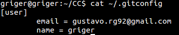
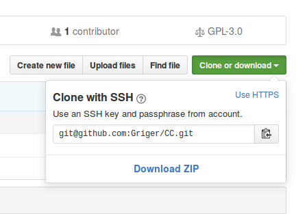

Ya se había configurado el nombre y el correo electrónico para git previamente por medio de los siguientes comandos:

```bash
git config --global user.name "griger"
git config --global user.email gustavo.rg92@gmail.com
```

Esto da como resultado el siguiente archivo **.gitconfig** que almacena la configuración global de git:



Sí que se ha generado una clave SSH de modo que no se soliten las credenciales de la cuenta de **GitHub** cada vez que realicemos un commit. Para ello hemos dos tutoriales:

- https://help.github.com/articles/generating-a-new-ssh-key-and-adding-it-to-the-ssh-agent/
- https://confluence.atlassian.com/bitbucket/set-up-ssh-for-git-728138079.html#SetupSSHforGit-startagent

Con lo que hemos empleado los siguientes comandos:

```bash
ssh-keygen -t rsa -b 4096 -C "gustavo.rg92@gmail.com"
```
hemos pulsado enter para que los ficheros donde se guardan las llaves tengan los nombres por defecto (*id_rsa e id_rsa.pub*) y sí hemos proporcionado una clave que se nos solicta cuando hay que emplear dicha llave en un commit.

Como en nuestro caso no estaba operativo el agente ssh entonces, como se sugiere en uno de los dos tutoriales, lo hemos arrancado manualmente y a continuación hemos añadido la clave creada al agente:

```bash
ssh-agent /bin/#!/usr/bin/env bash
ssh-add ~/.ssh/id-rsa
```

Luego no tenemos más que copiar el contenido del fichero **id-rsa.pub** para agregar una nueva clave SSH en nuestra cuenta GitHub desde la [web](https://github.com/settings/keys).

Por último en aquel (o aquellos) repositorios locales en los que queramos que se emplee la identificación vía SSH en lugar de por HTTPS por medio de nuestro usuario de GitHub y la contraseña, lo que haremos será modiciar el fichero .git/config en concreto el campo url que en nuestro caso contreto pasará de ser:

```bash
url = https://github.com/Griger/CC.git
```
a ser aquella dirección que podemos obtener si en el botón de la web de GitHub que nos da la opción de clonar el repositorio elegimos la opción SSH:



```bash
url = git@github.com:Griger/CC.git
```
con esto ya tendremos configurado el repositorio de la asignatura de modo que cuando hagamos un commit este se haga a través de la clave SSH, que tendremos que desbloquear (al menos en el primer commit) con la clave que le hayamos puesto a ésta.
