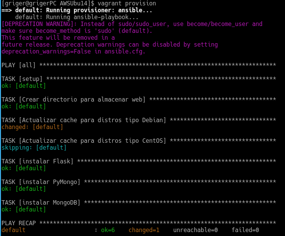
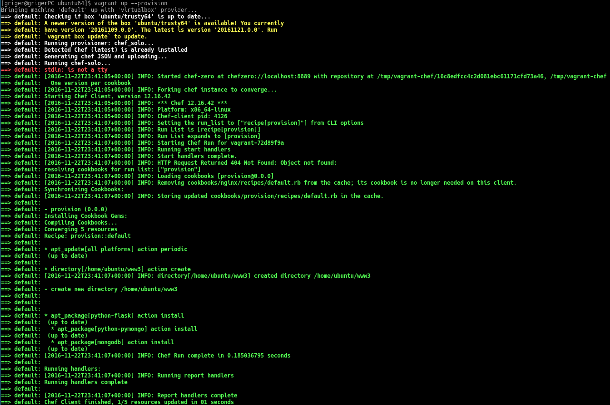

En mi caso he empleado el sistema de orquestación de máquinas virtuales Vagrant, ya que resulta muy cómodo para poder gestionar diversas máquinas virtuales en distintos hipervisores, ya sea VirtualBox, para las pruebas en local o **AWS** para desplegar nuestro proyecto en la nube.

Lo que pretendemos con este aprovisionamiento es añadir un directorio en el cual poder almacenar los ficheros de la aplicación que desarrollaremos, y añadir los paquetes para el funcionamiento de la misma: python-flask, python-pymongo y mongodb. Así el playbook de ansible quedaría como sigue:

```yml
---
  - hosts: all
    sudo: true
    tasks:
      - name: Crear directorio para almacenar web
        file: path=www state=directory

      - name: Actualizar cache para distros tipo Debian
        apt: update_cache=yes
        when: ansible_distribution == 'Debian' or ansible_distribution == 'Ubuntu'

      - name: Actualizar cache para distros tipo CentOS
        yum: update_cache=yes
        when: ansible_distribution == 'CentOS' or ansible_distribution == 'Red Hat Enterprise Linux'

      - name: instalar Flask
        package:
          name: python-flask
          state: present

      - name: instalar PyMongo
        package:
          name: python-pymongo
          state: present

      - name: instalar MongoDB
        package:
          name: mongodb
          state: present
```

Con la primera tarea lo que hacemos es simplemente crear un directorio llamada www que se creará en el directorio raíz del usuario. A continuación lo que hacemos es actualizar la caché, lo que sería el equivalente a hacer `apt-get update` en Ubuntu; esto lo hacemos ya que en muchas ocasiones se producen fallos en el provisionamiento al no encontrar el paquete que se pretende instalar, algo que, en muchos casos, se soluciona actualizando la caché.

Como vemos ha dos reglas muy similares, lo que hacemos es que dependiendo de qué distribución maneje nuestra máquina emplearemos apt o yum. Por esto se añade la cláusula when a las reglas, donde comprobamos de qué tipo de distribución se trata.

Por último las tres reglas siguientes lo que harán es instalar los tres paquetes que hemos mencionado anteriormente. Aquí tenemos el resultado de este provisionamiento:



Como vemos en esta ocasión no se producen errores y lo único que ocurre es que la tarea de actualizar la caché para máquina con distribuciones tipo CentOS se salta ya que no se dan las condiciones para la misma, pues que estamos en una MV con Ubuntu.

Para realizar este provisionamiento una vez que hemos arrancado la máquina virtual con `vagrant up` (ya veremos más en detalle este proceso en el siguiente hito) lo que hacemos es usar el comando `vagrant provision` que ejecutará todas las órdenes de provisionamiento que haya en el *Vagrantfile* de la máquina virtual que estemos gestionando. En el caso de Ansible, si hemos añadido el playbook en el mismo directorio donde está el *Vagrantfile* no tenemos más que añadir la siguiente directiva:

```bash
config.vm.provision :ansible do |ansible|
  ansible.playbook = "playbook.yml"
end
```
Ahora vemos el equivalente con chef, para ello debido a ciertos problemas para poder usar Chef junto a Vagrant en una máquina virtual AWS; se ha decidido hacer las pruebas en una MV local, gestionada también con Vagrant, con Ubuntu 16.04. Para ello hemos creado la siguiente receta chef:

```ruby
apt_update 'all platforms'

directory '/home/ubuntu/www'

["python-flask", "python-pymongo", "mongodb"].each do |p|
  package p do
    action :install
  end
end
```

Lo primero que hacemos es actualizar la caché igual que hacíamos anteriormente, luego creamos el directorio al que le damos un path completo ya que el camino de referencia no es el home del usuario principal de la máquina. Y a continuación con un bucle muy compacto instalamos los tres paquetes que ya hemos dicho que son necesarios.

Esta receta la ubicaremos dentro del directorio cookbooks/provision/recipes que colocaremos en el mismo directorio en el que esté el *Vagrantfile* para esta MV, y añadiremos la siguiente directiva al *Vagranfile* para que al hacer `vagrant provision` se use esta receta:

```bash
config.vm.provision "chef_solo" do |chef|
  chef.add_recipe "provision"
end
```
Aquí tenemos la salida resultado de este provisionamiento, en esta ocasión hemos realizado el provisionamiento al arrancar la máquina virtual, añadiendo el flag provision, `vagrant up --provision`, ya que de otro modo, si no es la primera vez que arrancamos la MV, ignorará las directivas de provisionamiento:


