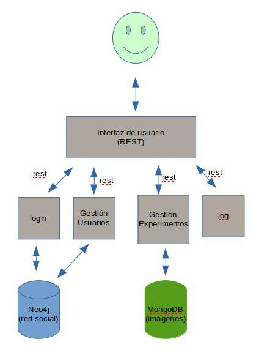

Mi proyecto al que he dado el nombre de NameIT pretende ser una plataforma para realizar experimentos realizados con la investigación en Generación de Lenguaje Natural (GLN). Durante el desarrollo de mi TFG he tenido que leer varios papers relacionados con el estudio del lenguaje natural, en particular mi TFG se centraba en la generación de expresiones de referencia para una objeto dentro de una escena, es decir, generar una descripción que identifique unívocamente a un objeto dentro de una escena.

En muchos de estos artículos se empleaba alguna plataforma en la que se le presentaba a varios usuarios distintas imágenes que ellos tenían que describir a fin de obtener información sobre cómo nos expresamos los seres humanos, y en particular cómo describimos los objetos. También se realizan este tipo de experimentos para por ejemplo ver cómo llama cada cuál a un determinado color que se le muestra o una textura concreta. Hasta donde yo conozco en cada experimento cada cual establece su plataforma para poder realizar esta experimentación, ya sea a través de una aplicación online o de forma presencial. NameIT pretende ser una plataforma en la cual los usuarios puedan alojar una batería de imágenes que se le presentarán a todos aquellos que accedan al experimento, donde se le formulará una pregunta común a todas las preguntas ("¿Qué color es este?") o una pregunta asociada a cada foto. En definitiva se pretende construir una plataforma de experimentación.

# Funcionamiento

La aplicación será muy sencilla, tras haberse dado de alta en NameIT se podrá acceder a crear un nuevo experimento. En este nuevo experimento añadiremos las imágenes que se desean para el mismo, subiéndolas a la plataforma, así como la pregunta o preguntas asociadas a las mismas. Entonces se creará una sitio para tal experimento (que se estudiará la opción de poder ser privado a fin de controlar el grupo que realiza el experimento, o añadir algún código de acceso al mismo) al que accederán distintas personas, que no han de estar dados de alta en la plataforma y realizarán el experimento que se les presente. Los resultados de los experimentos se podrán a disposición de los usuarios que han creado el experimento.

Además se incluirá una componente de red social en esta aplicación, de modo que otros investigadores puedan seguir el trabajo de otros y ponerse en contacto con ellos, a fin de crear una red de investigación en la generación de lenguaje natural lo suficientemente rica. Así se podrá solicitar "amistad" a otro usuario de la plataforma para estar informado sobre los experimentos que realiza y acceder a otro tipo de información.

# Infraestructura virtual

Esta aplicación se estructurará con un arquitectura basada en microservicios ya que me parece una arquitectura tremendamente flexible y de relativa facilidad de implementación. Además es de la infraestructura de la que tengo mayor información y me parece muy útil y adecuada para este proyecto, porque el modo en el que está pensada la aplicación es muy modular que es, al fin y al cabo, como estamos acostumbrados a pensar a la hora de programar aplicaciones monolíticas.

Los servicios que en principio se incorporarían a esta aplicación serían:

- Base da datos de tipo documental, **MongoDB**, donde se almacenarán las imágenes y otros tipos de información relacionada con la plataforma. Este tipo de base de datos nos da una gran escalabilidad, alta disponibilidad y un buen rendimiento.
- A fin de manejar de la mejor forma posible la información relativa al componente de red social de esta aplicación y conocer este tipo de bases de datos se empleará una base de datos basada en grafos, **Neo4j**.
- Se incorporará un servicio de **log** para obtener información sobre el funcionamiento y uso de la aplicación.
- El núcleo de la arquitectura estará implementado en Python empleando el framework web **Flask** que es más ligero y en principio parece ofrecer toda la funcionalidad necesaria para llevar a cabo esta aplicación. Aquí se centraría la interfaz de usuario.
- Servicio de **login de usuario**.
- Aquellos **módulos necesarios para la gestión de usuarios y red social** que se podrían agrupar en un servicio.
- Aquellos **módulos necesarios para la creación y gestión de experimentos** que lo podríamos agrupar en otro.

A priori no se contempla la inclusión de un sistema de mensajería debido a no estar seguro de la correcta envergadura de este proyecto.

# Provisionamiento

Se va a desplegar el proyecto en máquinas virtuales de AWS ya que se cuenta con el servicio de prueba gratuito durante un año y además contamos con 100$ de crédito por ser estudiantes de la UGR. Además AWS es un servicio muy usado en el mundo real con lo que familiarizarnos con este entorno tiene muchas ventajas. Por comodidad se ha optado por emplear un sistema de orquestación de máquinas virtuales como Vagrant para gestionar las máquinas virtuales que allí se crean. La máquina virtual que se va a emplear tiene Ubuntu 14.04 instalado, un sistema operativo muy conocido.

Como sistema de aprovisionamiento emplearemos Ansible ya que tiene una integración muy sencilla con Vagrant y además es un sistema muy cómodo de utilizar. Además este sistema sólo necesita que en la máquina remota esté instalado Python2. También se han creado los ficheros necesarios para realizar el provisionamiento con Chef (chef-solo) no obstante debido a problemas para realizar el provisionamiento a las máquinas AWS con chef y Vagrant, las pruebas se han realizado en una máquina virtual local con Ubuntu 16.04; también gestionada con Vagrant.

El provisionamiento que se ha realizado ha sido: crear un directorio donde almacenar los ficheros principales de la aplicación a desarrollar, y añadir los paquetes python-flask, python-pymongo y mongodb que serán esenciales para el desarrollo y funcionamiento de la misma. Para más detalles sobre el provisionamiento ver [aquí](documentos/provisionamiento).

- Documentación de los [objetivos](documentos/objetivos) que se llevarán a cabo como consecuencia del desarrollo del proyecto.

# Otros provisionamientos

Se ha testeado el provisionamiento realizado por @fblupi en [Ansible](https://github.com/fblupi/GEventator/issues/13) y [Chef](https://github.com/fblupi/GEventator/issues/17) para su proyecto; el testeo se ha realizado con máquinas virtuales orquestadas con Vagrant.

# Orquestación

En esta orquestación se ha optado por configurar una topología compuesta por tres máquinas virtuales: una que se encontrará en nuestra máquina o servidor local y otras dos en la nube, haciendo uso de los servicios de Amazon para tal efecto. Las tres máquinas empleadas contarán con una imagen Ubuntu 14 al ser un sistema operativo muy extendido y que proporciona toda la funcionalidad necesaria para llevar a cabo el despliegue del proyecto que se está desarrollando. Además la versión Python que cuenta es la 2.7 con lo que no da ningún tipo de complicación para provisionar estas máquina empleando Ansible, como sí que las daría una máquina con Ubuntu 16. Además, para las instancias AWS hemos optado por la arquitectura t2.micro ya que es la que está disponible para las versión gratis de prueba.

Hemos elegido Ansible como sistema de provisionamiento por su facilidad de uso y flexibilidad, por ejemplo el comando pip resulta muy útil para instalar módulos python a través de pip en la máquina local sin necesidad de añadir esta instrucción como una orden shell, aumentando la legibilidad del playbook.

Así las tres máquinas desplegadas son las siguientes:

* local: es la máquina que tendremos en nuestra máquina local 
